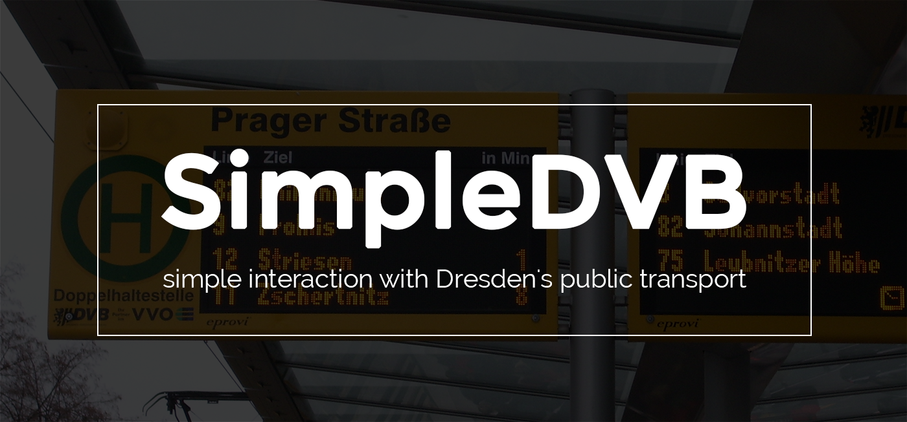

## SimpleDVB

A tool simplifying the interaction with Dresden's public transport provider.

There's two parts here, one of them being a RESTful api. Check out the API examples on the heroku app for more information on that (link at the top of the page).

The other part is the tool itself, which (once it's built) gives you an easy option of checking for buses, trams and route information in the network of the DVB.

Idea for header image shamelessly stolen from [hackathon-starter](https://github.com/sahat/hackathon-starter). It's also how this project started ;)
